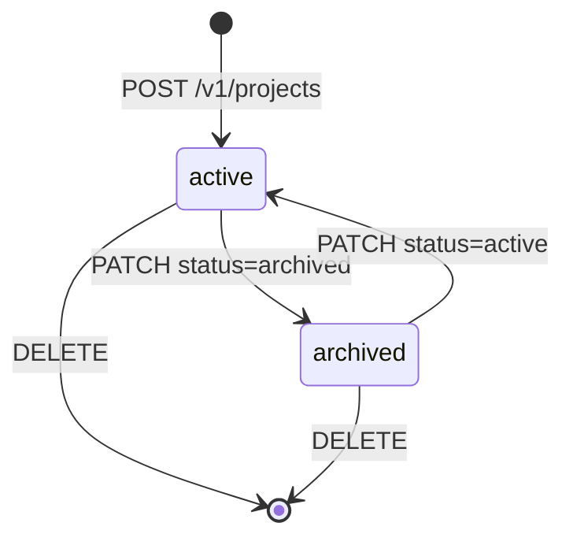

# Projects API

A project groups related work, members, and settings. This section documents the resource itself and one page per endpoint — each with schemas, multi-language samples, status codes, and business rules.

## Endpoints

| Endpoint | Purpose |
| --- | --- |
| [`GET /v1/projects`](/developers/projects-api/list-projects) | List projects with filtering and pagination. |
| [`POST /v1/projects`](/developers/projects-api/create-project) | Create a project. |
| [`GET /v1/projects/{id}`](/developers/projects-api/get-project) | Retrieve a single project. |
| [`PATCH /v1/projects/{id}`](/developers/projects-api/update-project) | Rename, archive, or restore a project. |
| [`DELETE /v1/projects/{id}`](/developers/projects-api/delete-project) | Permanently delete a project. |

## The project object

```json
{
  "id": "proj_8fK2m",
  "name": "Quarterly report",
  "status": "active",
  "members": 4,
  "created_at": "2026-07-01T09:30:00Z",
  "updated_at": "2026-07-20T14:05:12Z"
}
```

| Field | Type | Description |
| --- | --- | --- |
| `id` | string | Unique identifier, prefixed `proj_`. Stable for the project's lifetime. |
| `name` | string | Display name, 1–120 characters. Unique within a workspace. |
| `status` | string | `active` or `archived`. Archived projects are read-only. |
| `members` | integer | Count of workspace members with access. |
| `created_at` | string | ISO 8601 creation timestamp (UTC). |
| `updated_at` | string | ISO 8601 timestamp of the last change (UTC). |

## Lifecycle



## Roles and plans

| Action | Minimum role | Plan notes |
| --- | --- | --- |
| List, retrieve | Member | All plans. |
| Create | Admin | Free plan: 3 active projects maximum. |
| Update (rename, archive, restore) | Admin | Restore counts against the Free-plan limit. |
| Delete | Admin | All plans; irreversible. |

## Related

- [Authentication](/developers/authentication) — API keys and Bearer tokens
- [Webhooks](/developers/webhooks) — `project.*` events fired by these endpoints
