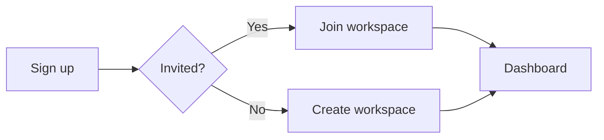

# Component library

Every component below is globally registered — use it in **any** `.md`/`.mdx` page with no import line. All styling flows from the design tokens in `src/css/tokens.css`.

## Cards

Clickable navigation cards in a responsive grid:

<CardGrid>
  <Card title="Getting started" icon="rocket" href="/getting-started">
    A clickable card — the whole surface is the link.
  </Card>
  <Card title="Static card" icon="package">
    Without `href`, a card is a plain content panel.
  </Card>
</CardGrid>

```jsx
<CardGrid>
  <Card title="Getting started" icon="rocket" href="/getting-started">
    A clickable card — the whole surface is the link.
  </Card>
  <Card title="Static card" icon="package">
    Without `href`, a card is a plain content panel.
  </Card>
</CardGrid>
```

`CardGrid` accepts `columns={2}` to force a fixed column count. `icon` takes a [Lucide](https://lucide.dev) icon name from the registry in `src/components/Card/icons.tsx` — at the time of writing: `rocket`, `book-open`, `code`, `puzzle`, `sliders`, `key`, `folder`, `bell`, `package` — rendered on a light brand-tinted chip beside the title. The registry file is the authoritative list; add icons by pasting Lucide paths into it. Emojis aren't used.

## Figure — image frames

Screenshots get a consistent frame, caption, and click-to-expand lightbox. `frame="browser"` adds browser chrome; try clicking the image:

<Figure
  src="/img/placeholder/dashboard.svg"
  alt="Dashboard with sidebar navigation, stat cards, and an activity chart"
  caption="frame=&quot;browser&quot; with zoom enabled (click the image)."
  frame="browser"
/>

```jsx
<Figure
  src="/img/products/dashboard.png"
  alt="Dashboard with sidebar navigation, stat cards, and an activity chart"
  caption="The dashboard after first sign-in."
  frame="browser"        // 'plain' (default) | 'browser' | 'none'
  zoom                   // click-to-expand lightbox (default true)
  width={720}            // optional max width
/>
```

## Video — video frames

Same framing system for short workflow clips. `autoPlay` turns a clip into a silent loop — controls stay visible so viewers can pause it (an accessibility requirement for moving content):

<Video
  src="/video/getting-started/getting-started-tour.mp4"
  poster="/video/getting-started/getting-started-tour.jpg"
  caption="Sample training video: from the help-center home through the Getting started guide (recorded with npm run record)."
  frame="browser"
/>

```jsx
<Video
  src="/video/projects/create-project.mp4"
  poster="/video/projects/create-project.jpg"  // npm run record generates this
  caption="Creating a project (12s)."
  frame="browser"          // 'plain' (default) | 'browser' | 'none'
  startAt={3}              // skip an intro: begin at 0:03
  playbackRate={1.25}      // speed up slow walkthroughs
  muted                    // start silent (implied by autoPlay)
  controls={false}         // hide the player bar (default: visible, even with autoPlay)
  captions="/video/projects/create-project.vtt"  // optional WebVTT captions track
  label="Creating a project walkthrough"         // optional accessible name for the player
/>

<Video src="/video/hint.mp4" autoPlay width={480} />
```

Videos are produced by `npm run record` (Playwright) and converted to web-ready H.264 by ffmpeg — see [Standards](/framework/standards).

## Carousel — step slideshows

A user-paced step slideshow — the lightweight alternative to `Video` when a task teaches better as discrete captioned states than as motion. Readers move through the slides with the arrow buttons, the dots, or the <kbd>←</kbd> / <kbd>→</kbd> keys; each slide carries its own caption, the current slide announces itself to screen readers, and a counter keeps the position visible:

<Carousel
  frame="browser"
  caption="A two-step slice of the add-item walkthrough — try the arrows or the arrow keys."
  slides={[
    {src: '/img/items/add-item-1.png', alt: 'The Items list with the Add New Item button outlined in blue in the top-right corner.', caption: 'Step 1 — Select Add New Item.'},
    {src: '/img/items/add-item-2.png', alt: 'The Add New Item form with the required Basic Information fields outlined.', caption: 'Step 2 — Fill the Basic Information fields.'},
  ]}
/>

```jsx
<Carousel
  frame="browser"
  caption="Adding an item, step by step."
  slides={[
    {src: '/img/items/add-item-1.png', alt: 'The Items list with the Add New Item button outlined in blue.', caption: 'Step 1 — Select Add New Item.'},
    {src: '/img/items/add-item-2.png', alt: 'The Add New Item form with the required fields outlined in yellow.', caption: 'Step 2 — Fill the Basic Information fields.'},
  ]}
/>
```

| Prop | Type | Default | Description |
| --- | --- | --- | --- |
| `slides` | array of `{src, alt, caption?}` | required | Ordered slides, one per step. `alt` is required on every slide; `caption` holds the step's instruction. |
| `frame` | `'plain'` &#124; `'browser'` | `'browser'` | `'browser'` adds browser chrome around the slide area for app screenshots. |
| `caption` | ReactNode | — | Overall caption under the carousel — what the sequence teaches. |
| `width` | number &#124; string | — | Optional max width. |

An empty `slides` array renders nothing, and in development a missing `alt` on any slide logs a console warning. Steps shown in a carousel must also remain self-contained in the surrounding text — see [Standards](/framework/standards).

## Steps

Wrap an ordered list to get numbered circles with a connecting line:

<Steps>

1. Open **Settings**.

2. Select **New API key**.

3. Store the generated key in your password manager.

</Steps>

```jsx
<Steps>

1. Open **Settings**.

2. Select **New API key**.

</Steps>
```

## Expandable

Collapsible sections for troubleshooting and optional detail — built on native `<details>`, so it works without JavaScript:

<Expandable title="When should I use Expandable?">

For content most readers skip: edge cases, long error lists, advanced options. Never hide required steps inside one.

</Expandable>

```jsx
<Expandable title="When should I use Expandable?" open>
  Body content — full Markdown works here.
</Expandable>
```

## Badge

Inline pills for plan tiers, roles, and feature states:

<Badge variant="new">New</Badge> <Badge variant="beta">Beta</Badge> <Badge variant="pro">Pro plan</Badge> <Badge variant="admin">Admin</Badge> <Badge variant="info">Info</Badge>

```jsx
<Badge variant="pro">Pro plan</Badge>
```

## API components

`ApiEndpoint` renders a method badge + path line for REST references:

<ApiEndpoint method="GET" path="/v1/projects">Returns all projects in the workspace.</ApiEndpoint>
<ApiEndpoint method="POST" path="/v1/projects">Creates a project.</ApiEndpoint>
<ApiEndpoint method="DELETE" path="/v1/projects/{id}">Permanently deletes a project.</ApiEndpoint>

```jsx
<ApiEndpoint method="GET" path="/v1/projects">Returns all projects.</ApiEndpoint>
```

`Tabs` (Docusaurus built-in, globally registered) hold multi-language samples — `groupId` syncs the choice across the whole site:

<Tabs groupId="lang">
<TabItem value="curl" label="curl">

```bash
curl https://api.example.com/v1/projects -H "Authorization: Bearer sk_live_…"
```

</TabItem>
<TabItem value="python" label="Python">

```python
requests.get("https://api.example.com/v1/projects", headers=headers)
```

</TabItem>
</Tabs>

See the [Projects API](/developers/projects-api/) section for both in real use.

## Tables

Plain Markdown tables are styled globally — header fill, zebra stripes, row hover:

| Setting | Default | Description |
| --- | --- | --- |
| Session timeout | 30 min | Idle time before sign-out. |
| Two-factor auth | Off | Require a second factor at sign-in. |
| API rate limit | 60/min | Requests per key per minute. |

## Keyboard keys

Use `<kbd>` anywhere: press <kbd>Ctrl</kbd> + <kbd>K</kbd> to search.

## Diagrams

Mermaid renders from a plain code fence:



## Admonitions

Docusaurus callouts, themed by the global tokens:

:::tip
Prefer `:::tip` for shortcuts and best practices.
:::

:::warning
Use `:::warning` before destructive or irreversible actions.
:::

## Page feedback

A slim "Was this page helpful?" row with thumbs-up / thumbs-down buttons appears under every doc page's footer. Unlike the components above, it isn't written into pages — the `src/theme/DocItem/Footer` wrapper mounts it automatically, so no page ever references it.

The widget is config-gated and hidden by default: it renders only after `feedback.endpoint` in `site.config.ts` points at an API endpoint (for example `/api/docs-feedback`). Each vote POSTs a JSON body of `{route, helpful, ts}` to that endpoint, then the row swaps to a thank-you message. Votes are remembered per route in the browser's localStorage, so a page never asks the same reader twice. See [Configuration](/framework/configuration) for the setting.
