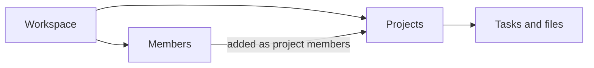

# Projects and workspaces

A workspace is your team's shared space — it holds every member, project, and setting. A project groups related work inside a workspace: its tasks, its files, and the members who can access them.

## Why it matters

Everything else in the product hangs off this model. Roles decide which buttons you see and which [API calls](/developers/projects-api/) succeed, plan limits count **active projects per workspace**, and [webhook events](/developers/webhooks) describe changes to exactly these objects. Understanding the model once saves you a lookup on every other page.

## How it works

A workspace contains members and projects; members are added to projects to see and work on them:

Every member holds one workspace role:

| Role | What it allows |
| --- | --- |
| Owner | Everything Admin allows, plus billing, plan changes, and deleting the workspace. One per workspace. |
| Admin | Manage projects (create, rename, archive, restore, delete) and invite or remove members. |
| Member | See and work in the projects they belong to. |

API keys [inherit the role](/developers/authentication) of the user who created them — an Admin's key can create projects; a Member's key can only read the projects that user belongs to.

### The member lifecycle

Members join a workspace by invitation:

1. An Admin (or the Owner) sends an invitation — the person's status is **invited**, and the [`member.invited`](/developers/webhooks) webhook event fires.
2. The person accepts the invitation and chooses a password — their status becomes **active**, and `member.joined` fires.
3. An Admin adds them to projects; a project's `members` count tracks who has access.

Invitations expire after 7 days; an Admin can re-send an expired one.

### The project lifecycle

Projects are **active** when created, can be **archived** (read-only, restorable, doesn't count against plan limits), and can be **deleted** (permanent). The [lifecycle diagram](/developers/projects-api/#lifecycle) in the API reference shows the exact transitions.

## Key properties

| Property | Meaning |
| --- | --- |
| Workspace | Top-level container for members, projects, and settings. Also the scope of API keys and name uniqueness. |
| Project | A group of related work. `active` or `archived`; project names are unique within a workspace. |
| Role | Owner, Admin, or Member — set per workspace, inherited by that user's API keys. |
| Member status | `invited` until the invitation is accepted, then `active`. |
| Plan limit | The Free plan allows 3 active projects per workspace; archived projects don't count. |

## Related

- [Getting started](/getting-started) — accept an invitation and reach your first project
- [Managing projects](/guides/managing-projects) — create a project step by step
- [Webhooks](/developers/webhooks) — the `project.*` and `member.*` events this model emits
