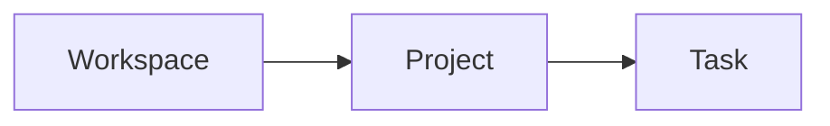

# Noun

Definition in one or two sentences — what this is, in the reader's language.

## Why it matters

The problem this concept solves for the user, in a short paragraph.

## How it works

Explain the model. Use a Mermaid diagram when relationships matter:

## Key properties

| Property | Meaning |
| --- | --- |
| … | … |

## Related

- [Task that uses this concept](/path)
